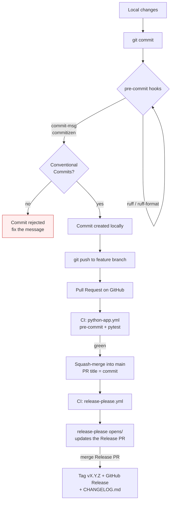
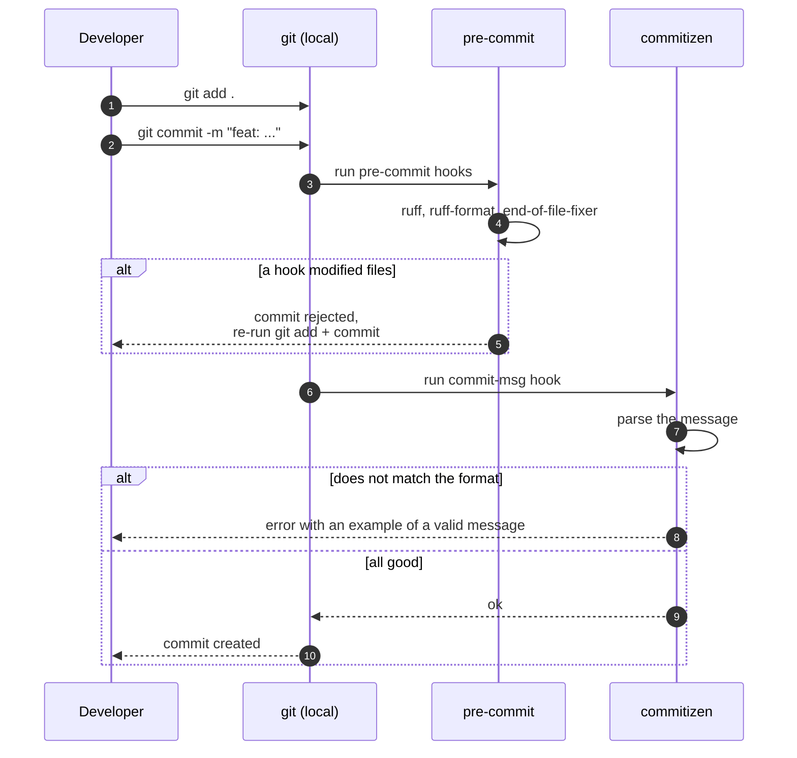
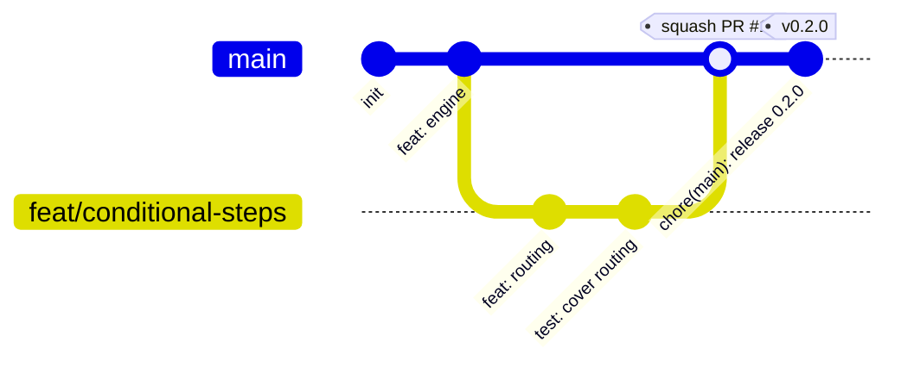
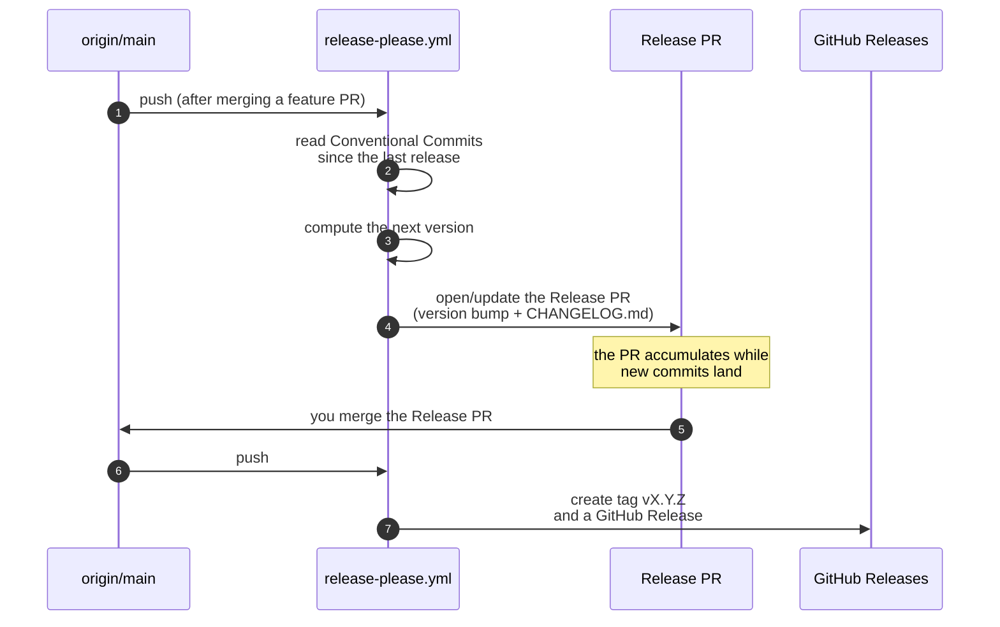

# Workflow: how it all works

> 🌐 **Languages:** [Русский](WORKFLOW.md) · English (current)

This document describes the full cycle — from the first `git commit` to a GitHub
Release — and how to organize work through feature branches.

> All diagrams are written in [Mermaid](https://mermaid.js.org/). GitHub renders
> them automatically.

---

## 1. The big picture



The key idea: **commit messages are the "source" of the changelog**. That is why
their format is strictly checked at `git commit` time, before the code even
reaches the server, and release-please turns them into a version and a CHANGELOG.

---

## 2. Conventional Commits — message format

```
<type>(<scope>)!: <subject>

<body>

<footer>
```

`type` is required, the rest is optional. A `!` after the type/scope marks a
breaking change.

| Type       | When to use                                       | In CHANGELOG / release       |
|------------|---------------------------------------------------|------------------------------|
| `feat`     | New functionality                                 | **Features** · minor         |
| `fix`      | Bug fix                                           | **Bug Fixes** · patch        |
| `perf`     | Performance improvement                           | **Performance** · patch      |
| `revert`   | Revert of a previous commit                       | **Reverts** · patch          |
| `docs`     | Documentation only                                | hidden, no release           |
| `refactor` | Refactoring without behavior change               | hidden, no release           |
| `test`     | Adding/updating tests                             | hidden, no release           |
| `build`    | Build, dependencies (pyproject.toml, poetry.lock) | hidden, no release           |
| `ci`       | GitHub Actions, pre-commit                        | hidden, no release           |
| `style`    | Formatting, no logic change                       | hidden, no release           |
| `chore`    | Chores with no impact on the code                 | hidden, no release           |

> Which types appear in the CHANGELOG and trigger a release is configured via
> `changelog-sections` in [release-please-config.json](../release-please-config.json).
> Currently a release is cut only for `feat` / `fix` / `perf` / `revert`; the
> rest is hidden.

**Examples:**

```bash
git commit -m "feat(engine): add conditional step routing"
git commit -m "fix(validators): trim whitespace before length check"
git commit -m "feat(engine)!: drop sync submit() in favour of async"   # breaking
git commit -m "refactor: extract session store into module"
```

For a breaking change use either `!` or a footer:

```
feat(engine): switch to async validators

BREAKING CHANGE: validators must now be coroutines.
```

**How the commit type affects the version** (release-please counts commits since
the last release):

- `BREAKING CHANGE` → **minor** while on `0.x` (major after `1.0.0`);
- `feat:` → **minor** (0.1.0 → 0.2.0);
- `fix:` / `perf:` → **patch** (0.1.0 → 0.1.1);
- everything else → no version change.

> While the project is on `0.x`, a breaking change bumps minor rather than major —
> which is normal for a library that has not shipped `1.0.0` yet
> (`bump-minor-pre-major` in `release-please-config.json`).

---

## 3. Local development loop



Install the hooks (once, after `poetry install`):

```bash
poetry run pre-commit install --hook-type pre-commit --hook-type commit-msg
```

If you are unsure about the format, there is an interactive mode:

```bash
poetry run cz commit     # walks you through and assembles the message
```

---

## 4. Branches — GitHub Flow



- A single long-lived branch: `main`, always green and releasable.
- All work happens on short feature branches `feat/...`, `fix/...`, `chore/...`.
- **Squash-merge** via a PR with green CI: the atomic commits stay in the PR, and
  `main` gets a single commit with the PR title — so history stays linear and the
  changelog stays clean (one entry per PR).
- Releases are handled by release-please through a dedicated Release PR (see §6).

### A few rules

1. **Small PRs.** Three 200-line PRs beat one 600-line PR.
2. **One topic per branch.** Don't mix refactoring with a feature.
3. **The PR title is a valid Conventional Commit.** On squash it becomes the
   commit on `main` and lands in the changelog.
4. **Branch names:** `feat/<short>`, `fix/<short>`, `chore/<short>`.
5. **Never push --force to main.** To your own feature branch — fine after a
   rebase, via `--force-with-lease`.

---

## 5. Step-by-step team loop

```bash
# 1. Fresh main
git switch main
git pull --ff-only

# 2. New branch
git switch -c feat/conditional-steps

# 3. Work + atomic commits (they live in the PR)
git add dialog_engine/
git commit -m "feat(engine): add conditional step routing"
git commit -m "test(engine): cover conditional routing"

# 4. Push and open a PR (PR title = the future squash commit)
git push -u origin feat/conditional-steps
gh pr create --title "feat(engine): conditional step routing" --body "Closes #42"

# 5. After green CI — squash-merge, delete the branch
gh pr merge --squash --delete-branch

# 6. Cleanup
git switch main && git pull --ff-only
```

### Rebase or merge?

The rule: **rebase for your own branches, squash to land on `main`**. After a
rebase use `git push --force-with-lease` (safer than `--force`).

---

## 6. Releases — release-please

Versions, tags, GitHub Releases, and `CHANGELOG.md` are fully automated — you do
not bump or tag anything by hand.



How it looks in practice:

1. You merge regular feature PRs into `main` with Conventional messages.
2. release-please opens (and keeps up to date) a **Release PR** named
   `chore(main): release X.Y.Z` — it bumps the version in `pyproject.toml` and
   `dialog_engine/__init__.py` and generates `CHANGELOG.md`.
3. When you are ready to ship — **merge the Release PR**. release-please creates
   the `vX.Y.Z` tag and publishes the GitHub Release.

> release-please never pushes to `main` directly — only through a Release PR, so a
> protected `main` keeps working.

**One-time repository setup** (so the action can open PRs): Settings → Actions →
General → Workflow permissions → enable *Read and write permissions* and *Allow
GitHub Actions to create and approve pull requests*.

---

## 7. What backs this in the repo

| File | What it does |
|------|--------------|
| [.pre-commit-config.yaml](../.pre-commit-config.yaml) | ruff + ruff-format + commitizen on every `git commit` |
| [pyproject.toml](../pyproject.toml) (`[tool.commitizen]`) | Commit-message validation config |
| [.github/workflows/python-app.yml](../.github/workflows/python-app.yml) | CI on every PR: pre-commit + pytest |
| [.github/workflows/release-please.yml](../.github/workflows/release-please.yml) | Releases: Release PR → tag + GitHub Release |
| [release-please-config.json](../release-please-config.json) | Release type, version files, bump rules and `changelog-sections` |
| [.release-please-manifest.json](../.release-please-manifest.json) | Current released version (release-please state) |
| [CHANGELOG.md](../CHANGELOG.md) | Auto-generated by release-please. **Do not** edit by hand. |

---

## TL;DR

1. Commit messages follow Conventional Commits, otherwise the commit is rejected.
2. Each task is a short `feat/...` branch, landed via a **squash PR** into `main`.
3. `main` always has green CI and is always releasable.
4. A release = merging the Release PR driven by release-please. Versions, tags,
   and the CHANGELOG are generated from commit history — nobody writes them by hand.
