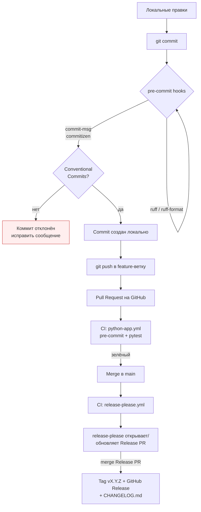
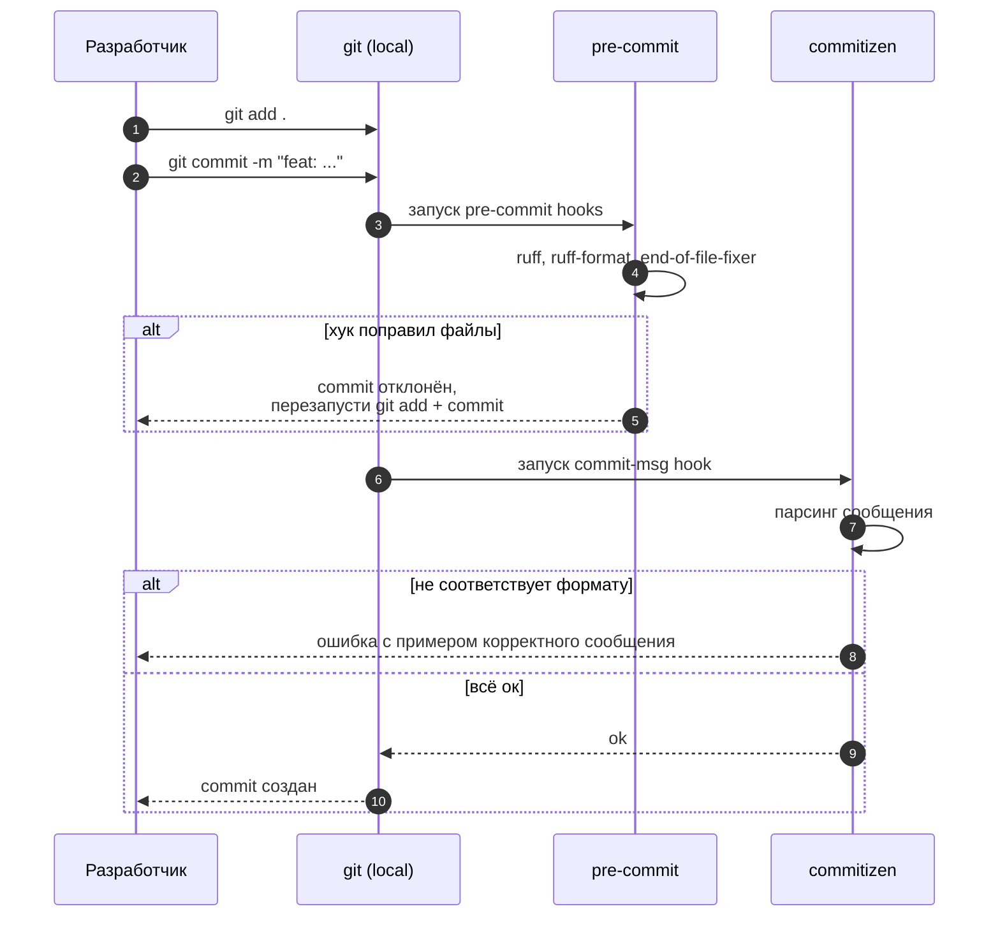
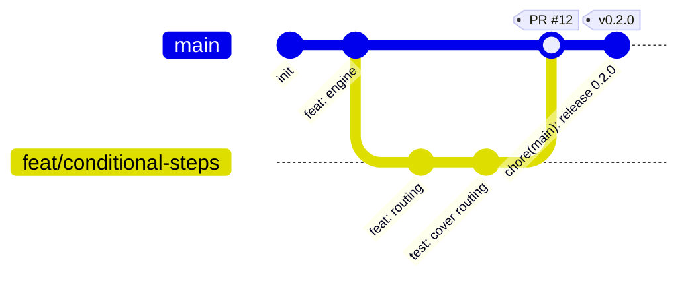
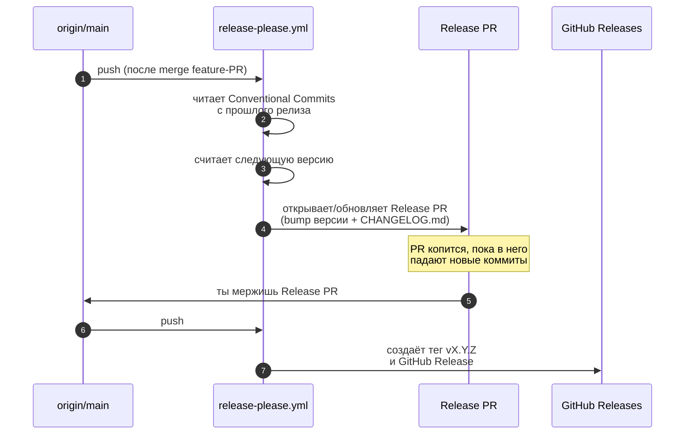

# Workflow: как это всё работает

Документ описывает полный цикл — от первого `git commit` до GitHub Release — и
как организовать работу через feature-ветки.

> Все диаграммы написаны на [Mermaid](https://mermaid.js.org/). GitHub
> рендерит их автоматически.

---

## 1. Большая картина



Главное: **сообщения коммитов — это и есть «исходник» changelog'а**. Поэтому их
формат жёстко проверяется на этапе `git commit`, до того как код попадёт на
сервер, а release-please превращает их в версию и CHANGELOG.

---

## 2. Conventional Commits — формат сообщений

```
<type>(<scope>)!: <subject>

<body>

<footer>
```

`type` обязателен, остальное опционально. `!` после типа/скоупа означает
breaking change.

| Type       | Когда использовать                              | Попадает в CHANGELOG как |
|------------|--------------------------------------------------|--------------------------|
| `feat`     | Новая функциональность                          | **Features**             |
| `fix`      | Исправление бага                                 | **Bug Fixes**            |
| `perf`     | Улучшение производительности                     | **Performance**          |
| `refactor` | Рефакторинг без изменения поведения              | (скрыто по умолчанию)    |
| `docs`     | Только документация                              | **Documentation**        |
| `test`     | Добавление/правка тестов                         | (скрыто по умолчанию)    |
| `build`    | Сборка, зависимости (pyproject.toml, poetry.lock)| **Build System**         |
| `ci`       | GitHub Actions, pre-commit                       | (скрыто по умолчанию)    |
| `chore`    | Рутина, без влияния на код                       | (скрыто по умолчанию)    |
| `revert`   | Откат прошлого коммита                            | **Reverts**              |

**Примеры:**

```bash
git commit -m "feat(engine): add conditional step routing"
git commit -m "fix(validators): trim whitespace before length check"
git commit -m "feat(engine)!: drop sync submit() in favour of async"   # breaking
git commit -m "refactor: extract session store into module"
```

Для breaking change можно либо `!`, либо футер:

```
feat(engine): switch to async validators

BREAKING CHANGE: validators must now be coroutines.
```

**Как тип коммита влияет на версию** (release-please считает по коммитам с
прошлого релиза):

- `BREAKING CHANGE` → **minor**, пока версия `0.x` (после `1.0.0` — major);
- `feat:` → **minor** (0.1.0 → 0.2.0);
- `fix:` / `perf:` → **patch** (0.1.0 → 0.1.1);
- остальное → версия не меняется.

> Пока проект на `0.x`, breaking change поднимает minor, а не major — это
> нормально для библиотеки, ещё не выпустившей `1.0.0`
> (`bump-minor-pre-major` в `release-please-config.json`).

---

## 3. Локальный цикл разработки



Поставить хуки (один раз после `poetry install`):

```bash
poetry run pre-commit install --hook-type pre-commit --hook-type commit-msg
```

Если запутался в формате — есть интерактивный режим:

```bash
poetry run cz commit     # пройдёт по шагам и соберёт сообщение
```

---

## 4. Ветки — GitHub Flow



- Одна долгоживущая ветка: `main`, всегда зелёная и релизуемая.
- Любая работа — короткая feature-ветка `feat/...`, `fix/...`, `chore/...`.
- Merge через PR с зелёным CI.
- Релиз делает release-please через отдельный Release PR (см. §6).

### Несколько правил

1. **Маленькие PR.** Лучше три PR по 200 строк, чем один на 600.
2. **Одна тема на ветку.** Не смешивай рефакторинг с фичей.
3. **Имена веток:** `feat/<кратко>`, `fix/<кратко>`, `chore/<кратко>`.
4. **Защити main.** Settings → Branches: require PR, require CI green.
5. **Никогда не push --force в main.** В свою feature-ветку — можно после
   rebase, через `--force-with-lease`.

---

## 5. Командный цикл по шагам

```bash
# 1. Свежий main
git switch main
git pull --ff-only

# 2. Новая ветка
git switch -c feat/conditional-steps

# 3. Работа + атомарные коммиты
git add dialog_engine/
git commit -m "feat(engine): add conditional step routing"
git commit -m "test(engine): cover conditional routing"

# 4. Пуш и PR
git push -u origin feat/conditional-steps
gh pr create --title "feat(engine): conditional step routing" --body "Closes #42"

# 5. После зелёного CI — merge, удалить ветку
gh pr merge --merge --delete-branch

# 6. Уборка
git switch main && git pull --ff-only
```

### Rebase или merge?

Правило: **rebase для своих веток, merge для общих**. После rebase —
`git push --force-with-lease` (безопаснее `--force`).

---

## 6. Релиз — release-please

Версии, теги, GitHub Releases и `CHANGELOG.md` полностью автоматизированы — руками
ничего бампить и тегировать не нужно.



Как это выглядит на практике:

1. Мержишь обычные feature-PR в `main` с Conventional-сообщениями.
2. release-please сам открывает (и держит актуальным) **Release PR** вида
   `chore(main): release X.Y.Z` — в нём поднята версия в `pyproject.toml` и
   `dialog_engine/__init__.py` и сгенерирован `CHANGELOG.md`.
3. Когда готов выпустить — **мержишь Release PR**. release-please ставит тег
   `vX.Y.Z` и публикует GitHub Release.

> release-please никогда не пушит в `main` напрямую — только через Release PR,
> поэтому защищённый `main` продолжает работать.

**Разовая настройка репозитория** (нужна, чтобы action мог открывать PR):
Settings → Actions → General → Workflow permissions → включить
*Read and write permissions* и *Allow GitHub Actions to create and approve pull
requests*.

---

## 7. Что лежит за этим в репо

| Файл | Что делает |
|------|------------|
| [.pre-commit-config.yaml](../.pre-commit-config.yaml) | ruff + ruff-format + commitizen на каждом `git commit` |
| [pyproject.toml](../pyproject.toml) (`[tool.commitizen]`) | Конфиг валидации формата коммитов |
| [.github/workflows/python-app.yml](../.github/workflows/python-app.yml) | CI на каждый PR: pre-commit + pytest |
| [.github/workflows/release-please.yml](../.github/workflows/release-please.yml) | Релизы: Release PR → тег + GitHub Release |
| [release-please-config.json](../release-please-config.json) | Тип релиза, файлы с версией, правила bump |
| [.release-please-manifest.json](../.release-please-manifest.json) | Текущая выпущенная версия (состояние release-please) |
| [CHANGELOG.md](../CHANGELOG.md) | Авто-генерируется release-please. Руками **не редактировать**. |

---

## TL;DR

1. Commit-сообщения — по Conventional Commits, иначе коммит не пройдёт.
2. Каждая задача — короткая ветка `feat/...`, через PR в `main`.
3. На `main` всегда зелёный CI и всегда релизуемо.
4. Релиз = смержить Release PR, который ведёт release-please. Версии, теги и
   CHANGELOG генерируются из истории коммитов — руками их никто не пишет.
